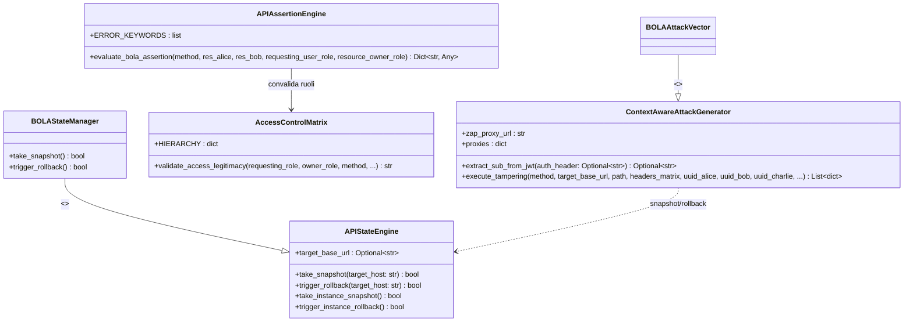
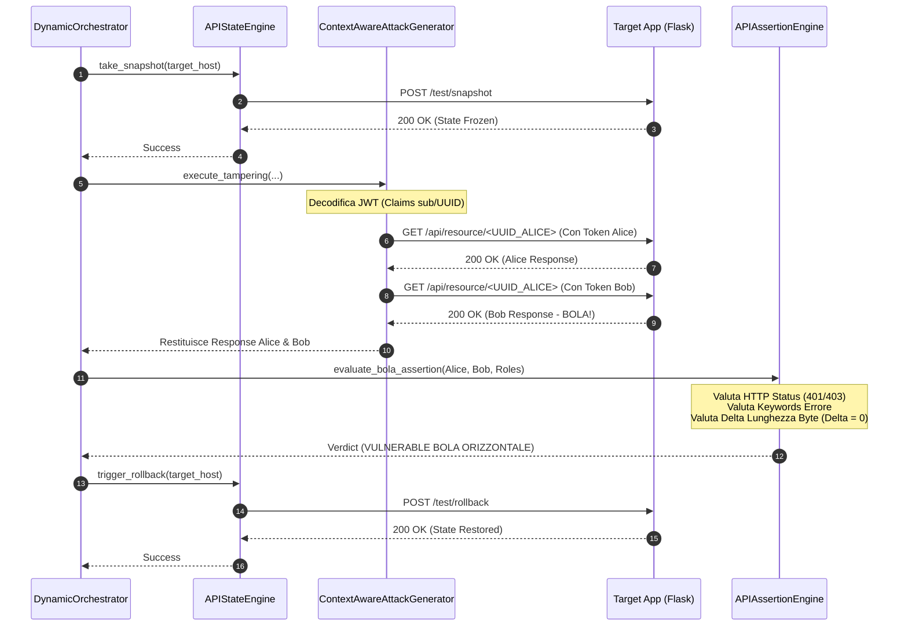

# Documento di Progetto dell'Oggetto (Object Design Document - ODD)
## Sottosistema di Runtime Security per il Rilevamento BOLA (OWASP API1:2023)
**Autore**: Gruppo di Ingegneria del Software & Cloud Security
**Destinatario**: Chiar.mo Prof. di Ingegneria del Software

---

## 1. Decomposizione del Sistema e Architettura
Il sottosistema adotta l'architettura a **Separazione delle Responsabilità (Separation of Concerns)**, riducendo l'accoppiamento tra il modulo di orchestrazione dei test dinamici, la business logic autorizzativa ed il motore di validazione semantica a livello applicativo.

### 1.1 Diagramma delle Classi (UML Class Diagram)



---

## 2. Classificazione BCE (Boundary-Control-Entity)
Secondo il paradigma **BCE (Boundary-Control-Entity)** di Ivar Jacobson, le classi del sistema sono così mappate per massimizzare la coesione e minimizzare l'accoppiamento:

| Classe di Progetto | Ruolo BCE | Giustificazione Architetturale |
| :--- | :--- | :--- |
| `APIStateEngine` | **Boundary** | Gestisce la barriera di comunicazione I/O verso l'API esterna del target (`/test/snapshot`, `/test/rollback`). |
| `ContextAwareAttackGenerator` | **Boundary** | Interfaccia la logica di attacco verso il proxy di rete OWASP ZAP ed effettua stimolazioni HTTP. |
| `DynamicOrchestrator` | **Control** | Coordina il workflow dei test, la sequenza temporale e il passaggio dei parametri tra moduli. |
| `AccessControlMatrix` | **Entity** | Incapsula le regole di business stabili del dominio e la Privilege Matrix (Modello dati dei ruoli). |
| `APIAssertionEngine` | **Entity** | Contiene la logica computazionale pura e le asserzioni di Differential Testing (Valutatore di stato). |

---

## 3. Analisi di Conformità dei Principi SOLID

* **Single Responsibility Principle (SRP)**:
  Ogni classe ha un unico motivo di cambiamento. Ad esempio, `APIStateEngine` muta solo in caso di variazione dei protocolli di persistenza dello stato target; `AccessControlMatrix` muta solo in caso di ridefinizione delle politiche di business autorizzative.
* **Open/Closed Principle (OCP)**:
  `APIAssertionEngine` è aperto all'estensione di nuove parole chiave di errore o nuovi calcoli di similarità senza dover modificare la struttura di coordinamento del verdetto logico.
* **Liskov Substitution Principle (LSP)**:
  I moduli legacy `BOLAStateManager` e `BOLAAttackVector` derivano direttamente dalle nuove classi `APIStateEngine` e `ContextAwareAttackGenerator`, garantendo la sostituibilità immediata senza alterare il comportamento atteso dai chiamanti.
* **Interface Segregation Principle (ISP)**:
  Gli scanner implementano l'interfaccia snella `IScanner` definita in `src/domain/interfaces.py`, forzando solo la definizione del metodo `scan()` senza dipendenze da metodi accessori non utilizzati.
* **Dependency Inversion Principle (DIP)**:
  L'orchestratore non istanzia in modo rigido gli scanner statici, ma consuma istanze che implementano l'astrazione `IScanner`, permettendo il plug-in dinamico di nuovi analizzatori (es. Semgrep, Checkov, Spectral).

---

## 4. Design Patterns Applicati (UML Mapping)

### 4.1 Template Method / Strategy (Analizzatori Statici)
L'architettura definisce l'interfaccia astratta `IScanner`. Ciascun adapter (`CheckovScannerAdapter`, `SemgrepScannerAdapter`, `SpectralScannerAdapter`) incapsula una specifica strategia di analisi statica.

### 4.2 Adapter (Adattatori Legacy per Retrocompatibilità)
Le classi `BOLAStateManager` e `BOLAAttackVector` fungono da **Object Adapters** per mappare le chiamate legacy basate su istanza verso i nuovi metodi statici e flessibili introdotti nel refactoring accademico.

### 4.3 Chain of Responsibility / Rule Engine (Assertion Engine)
`APIAssertionEngine` valuta una sequenza ordinata di asserzioni indipendenti (`http_status_assertion` -> `content_keyword_assertion` -> `structural_similarity_assertion`). Se una delle asserzioni di sicurezza fallisce, il flusso interrompe la computazione e classifica l'endpoint come `SAFE`, evitando controlli strutturali inutili.

---

## 5. Specifica delle Interfacce e Contratto dei Metodi

### 5.1 APIStateEngine
```python
class APIStateEngine:
    """
    PRE-CONDIZIONE: L'host di destinazione deve esporre gli endpoint di test attivi.
    POST-CONDIZIONE: Lo stato dell'applicazione viene memorizzato o ripristinato.
    """
    @staticmethod
    def take_snapshot(target_host: str) -> bool:
        """
        Invia una richiesta sincrona POST per salvare lo stato attuale.
        Input: target_host (str) - L'indirizzo URL del server target.
        Output: bool - True se l'operazione ha avuto successo.
        """
        pass

    @staticmethod
    def trigger_rollback(target_host: str) -> bool:
        """
        Invia una richiesta sincrona POST per ripristinare lo stato.
        Input: target_host (str) - L'indirizzo URL del server target.
        Output: bool - True se lo stato è stato ripristinato correttamente.
        """
        pass
```

### 5.2 AccessControlMatrix
```python
class AccessControlMatrix:
    """
    PRE-CONDIZIONE: I ruoli passati devono essere definiti o riconducibili alla gerarchia di business.
    POST-CONDIZIONE: Restituisce una stringa costante rappresentante il verdetto logico.
    """
    @classmethod
    def validate_access_legitimacy(cls, requesting_role: str, owner_role: str, method: str) -> str:
        """
        Valuta i privilegi gerarchici e determina la violazione attesa.
        Input: requesting_role (str), owner_role (str), method (str)
        Output: str - "LEGITTIMO" | "BOLA_ORIZZONTALE" | "BOLA_VERTICALE"
        """
        pass
```

### 5.3 APIAssertionEngine
```python
class APIAssertionEngine:
    """
    PRE-CONDIZIONE: Le risposte HTTP di Alice e Bob devono essere valide e non nulle.
    POST-CONDIZIONE: Calcola i delta byte e solleva l'alert se si riscontra BOLA.
    """
    @classmethod
    def evaluate_bola_assertion(
        cls, 
        method: str, 
        res_alice: requests.Response, 
        res_bob: requests.Response,
        requesting_user_role: str,
        resource_owner_role: str
    ) -> Dict[str, Any]:
        """
        Input: method (str), res_alice (Response), res_bob (Response), requesting_user_role (str), resource_owner_role (str)
        Output: dict - Mappa dettagliata con esiti di validazione e il verdetto.
        """
        pass
```

---

## 6. Diagramma di Sequenza dei Test (Workflow D-AST)



---

## 7. Matrice di Tracciabilità dei Requisiti (Traceability Matrix)

Questa matrice garantisce la tracciabilità bidirezionale tra i requisiti analitici del RAD e gli oggetti concreti del design del codice (ODD):

| ID Requisito (RAD) | Classe di Design (ODD) | Metodo Concreto | File di Sorgente |
| :--- | :--- | :--- | :--- |
| **FR-1.1 (Snapshot)** | `APIStateEngine` | `take_snapshot` | `state_manager.py` |
| **FR-1.2 (Rollback)** | `APIStateEngine` | `trigger_rollback` | `state_manager.py` |
| **FR-2.1 (JWT Decoding)** | `ContextAwareAttackGenerator` | `extract_sub_from_jwt` | `attack_vector.py` |
| **FR-2.2 (Tampering)** | `ContextAwareAttackGenerator` | `execute_tampering` | `attack_vector.py` |
| **FR-3.1 (Role Evaluation)** | `AccessControlMatrix` | `validate_access_legitimacy` | `role_matrix.py` |
| **FR-4.1 (HTTP Status)** | `APIAssertionEngine` | `evaluate_bola_assertion` | `assertion_engine.py` |
| **FR-4.2 (Keyword Scan)** | `APIAssertionEngine` | `evaluate_bola_assertion` | `assertion_engine.py` |
| **FR-4.3 (Structural delta)** | `APIAssertionEngine` | `evaluate_bola_assertion` | `assertion_engine.py` |
| **NFR-1.1 (Computation Time)**| `APIAssertionEngine` | `evaluate_bola_assertion` | `assertion_engine.py` |
| **NFR-2.2 (Integrity / Rollback)**| `APIStateEngine` / `Target App` | `/test/rollback` | `app.py` / `state_manager.py` |
| **NFR-4.2 (Testability / Coverage)**| Unit Tests Suite | `pytest` execution | `test_bola.py` |
