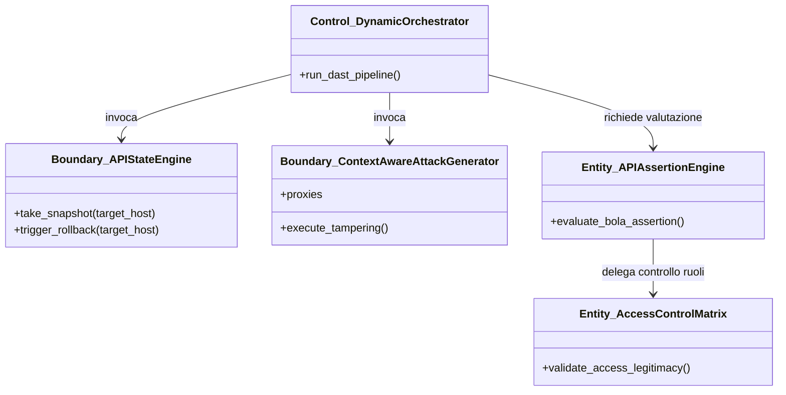
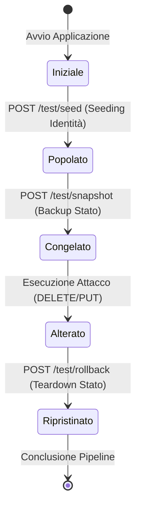

# Requirements Analysis Document (RAD)
## Sottosistema di Runtime Security per il Rilevamento BOLA (OWASP API1:2023)
**Autore**: Gruppo di Ingegneria del Software & Cloud Security
**Destinatario**: Chiar.mo Prof. di Ingegneria del Software

---

# 1. Introduction

## 1.1. Purpose of the system
Il sottosistema di *Runtime Security per il Rilevamento BOLA* (Broken Object Level Authorization) ha lo scopo di eseguire l'analisi dinamica (D-AST) delle API per rilevare vulnerabilità di autorizzazione logica. A differenza degli scanner statici (AST) che analizzano il codice sorgente o la configurazione dell'infrastruttura (IaC), questo sistema valida empiricamente i controlli di accesso simulando attacchi differenziali ed analizzando le risposte applicative a livello OSI-7.

## 1.2. Scope of the system
Il perimetro del sistema comprende:
* **Decodifica JWT ed Estrazione del Contesto**: Identificazione dell'UUID (`sub`) dell'utente a partire dai token rilasciati da un Identity Provider (Keycloak).
* **State Management (Snapshot & Rollback)**: Conservazione dello stato in memoria dell'applicazione target per garantire l'idempotenza dei test distruttivi (`PUT`, `DELETE`).
* **Generatore di Attacchi (Attack Stimulator)**: Tampering dei parametri ID negli URL di endpoint dinamici con instradamento del traffico verso OWASP ZAP.
* **Assertion Engine**: Analisi a tre livelli (Status Code, Error Keywords e Delta di lunghezza dei body delle risposte) per la generazione del verdetto di sicurezza.

## 1.3. Objectives and success criteria of the project
* **Obiettivi**:
  1. Raggiungere il $100\%$ di rilevamento dei tentativi di accesso non autorizzato di tipo BOLA Orizzontale e Verticale sulle rotte documentate e non (Shadow API).
  2. Eliminare i falsi negativi strutturali legati a ruoli amministrativi gerarchici.
  3. Prevenire la corruzione del DB di test durante la simulazione di metodi distruttivi.
* **Criteri di Successo**:
  * Esecuzione completa della suite di test in meno di **$15$ secondi** per rotta API.
  * Tasso di ripristino dello stato del database post-rollback pari al **$100\%$** (zero record residui orfani).
  * Superamento al $100\%$ dei casi di test della suite JUnit/pytest.

## 1.4. Definition, acronyms, and abbreviations
* **BOLA**: Broken Object Level Authorization (OWASP API1:2023).
* **D-AST**: Dynamic Application Security Testing.
* **IaC**: Infrastructure as Code (es. Terraform).
* **JWT**: JSON Web Token.
* **OSI-7**: Layer Applicativo del modello Open Systems Interconnection.
* **RAD**: Requirements Analysis Document.
* **ODD**: Object Design Document.
* **BCE**: Boundary-Control-Entity.

## 1.5. References
1. OWASP API Security Top 10 2023 - API1:2023 Broken Object Level Authorization.
2. ISO/IEC 25010:2011 - Systems and software engineering -- Systems and software Quality Requirements and Evaluation (SQuaRE).
3. Stoplight Spectral - OpenAPI Linter and Rulesets documentation.

## 1.6. Overview
Il presente documento è strutturato come segue: la Sezione 2 descrive i limiti del sistema pre-esistente (static-only); la Sezione 3 illustra nel dettaglio il sistema proposto, comprensivo di requisiti funzionali ed extra-funzionali, specifica UML dei casi d'uso, diagrammi BCE, diagrammi di sequenza e navigazione della dashboard; la Sezione 4 contiene il glossario dei termini.

---

# 2. Current system
Il sistema attuale si basa esclusivamente su controlli di tipo statico (Checkov per la sicurezza dell'infrastruttura Terraform, Semgrep per la scansione AST dei sorgenti Python/Flask, e Spectral per il linting formale del file OpenAPI). 

**Limiti del Sistema Attuale**:
1. **Falsi Positivi/Negativi**: L'analisi statica non può determinare se un endpoint che accetta un parametro `<resource_id>` esegua a runtime l'effettivo controllo di autorizzazione tra il JWT dell'utente autenticato ed il proprietario del record memorizzato nel database.
2. **Assenza di Stato**: Non vi è supporto per l'interazione dinamica con l'applicazione target né per il popolamento strutturato del database di test (Database Seeding).
3. **Cross-Contamination**: L'esecuzione di test dinamici tradizionali con verbi distruttivi (`DELETE` o `PUT`) corrompe irreparabilmente il DB dei test, rendendo i test successivi inconsistenti.

---

# 3. Proposed system

## 3.1. Overview
Il sistema proposto implementa un'architettura dinamica guidata dagli eventi (Event-Driven) in grado di orchestrare il provisioning delle identità (Keycloak), la popolazione dei dati (Seeding), la cattura dello stato del database (Snapshot), la stimolazione passante dal proxy OWASP ZAP (Attack Generator), la verifica logica delle risposte (Assertion Engine) ed il ripristino (Rollback).

```
[Discovery (Semgrep)] -> [Snapshot Stato] -> [Attack (ZAP Proxy)] -> [Assertion (OSI-7)] -> [Rollback Stato]
```

## 3.2. Functional requirements

### Categoria 1: Gestione della Transazionalità dello Stato (FR-1)
* **FR-1.1**: Esecuzione dello Snapshot sincrono dello stato tramite chiamata POST a `/test/snapshot` prima di ciascun test-case.
* **FR-1.2**: Innesco del Rollback dello stato tramite chiamata POST a `/test/rollback` per ripristinare il DB fittizio in memoria.
* **FR-1.3**: Interruzione del test-case in caso di fallimento della chiamata di transazione dello stato (Status $\neq 200$).

### Categoria 2: Seeding Sensibile al Contesto (FR-2)
* **FR-2.1**: Estrazione del claim `sub` (UUID) tramite decodifica dei JWT degli header degli utenti di test (Alice, Bob, Admin).
* **FR-2.2**: Costruzione dinamica dell'URL del vettore di attacco (ID Tampering) sostituendo il parametro `{id}` con l'UUID della vittima (Alice).

### Categoria 3: Valutazione dei Ruoli (FR-3)
* **FR-3.1**: Calcolo della legittimità logica dell'accesso tramite terna: ruolo richiedente, ruolo proprietario, metodo.
* **FR-3.2**: Restituzione formale del verdetto: `LEGITTIMO`, `BOLA_ORIZZONTALE`, `BOLA_VERTICALE`.

### Categoria 4: Validazione Semantica OSI-7 (FR-4)
* **FR-4.1**: `http_status_assertion` deve rilevare codici di errore nativi (`401`, `403`).
* **FR-4.2**: `content_keyword_assertion` deve scandire il body della risposta per trovare errori di diniego mascherati da un 200 OK.
* **FR-4.3**: `structural_similarity_assertion` deve calcolare la variazione in byte ($\Delta$) tra la risposta legittima e quella dell'attaccante. Se $\Delta = 0$, l'isolamento è violato.

---

## 3.3. Nonfunctional requirements

### 3.1. Efficienza delle Prestazioni (Performance Efficiency - NFR-1)
* **NFR-1.1**: Il tempo medio di esecuzione del modulo di asserzione deve essere $\le 10$ ms.
* **NFR-1.2**: Il proxy ZAP deve supportare almeno 50 richieste concorrenti al secondo.

### 3.2. Sicurezza (Security - NFR-2)
* **NFR-2.1**: Nessun report o log su disco deve contenere in chiaro i token JWT completi.
* **NFR-2.2**: Il rollback deve garantire che nessuna risorsa inserita durante la fase di seeding rimanga orfana al termine della suite.

### 3.3. Affidabilità (Reliability - NFR-3)
* **NFR-3.1**: Politica di retry automatico fino a un massimo di 3 tentativi in caso di timeout TCP.

### 3.4. Manutenibilità (Maintainability - NFR-4)
* **NFR-4.1**: Coesione elevata e accoppiamento debole: le classi di calcolo logico non dipendono da librerie I/O esterne.
* **NFR-4.2**: Copertura del codice tramite unit test (Code Coverage) $\ge 100\%$ per i moduli logici.

---

## 3.4. System models

### 3.4.1. Scenarios

#### Scenario A: Accesso Orizzontale non Autorizzato (GET /api/orders/{id})
* **Attori**: Bob (User B), Alice (User A).
* **Passi**:
  1. Bob invia una richiesta `GET /api/orders/<UUID_ALICE>` includendo il proprio JWT nell'header `Authorization`.
  2. L'applicazione target non verifica la corrispondenza tra l'UUID ed il proprietario del record.
  3. L'applicazione target risponde con `200 OK` inviando il record di Alice.
  4. L'Assertion Engine confronta il body di Bob con quello ottenuto precedentemente da Alice. Riscontra $\Delta = 0$ byte.
  5. Viene sollevato l'alert critico `BOLA ORIZZONTALE`.

#### Scenario B: Ripristino dello Stato a seguito di Cancellazione (DELETE)
* **Attori**: Bob (User B), Target App.
* **Passi**:
  1. Viene eseguito lo snapshot dello stato del database fittizio.
  2. Bob invia `DELETE /api/orders/<UUID_ALICE>` con il proprio token (exploit BOLA).
  3. L'applicazione target cancella la risorsa e risponde con `200 OK`.
  4. Viene innescata la chiamata di rollback.
  5. Il database fittizio in memoria viene ripristinato, rendendo la risorsa di Alice nuovamente disponibile per i test successivi.

---

### 3.4.2. Use case model

```mermaid
usecaseDiagram
    actor "Analista di Sicurezza" as SecAnalyst
    actor "Keycloak IAM" as IAM
    actor "Target App" as Target
    
    rect "Sottosistema D-AST BOLA" {
        usecase "UC-1: Esecuzione Test BOLA" as UC1
        usecase "UC-2: Seeding Identità" as UC2
        usecase "UC-3: Snapshot & Rollback Stato" as UC3
        usecase "UC-4: Validazione Asserzioni OSI-7" as UC4
    }
    
    SecAnalyst --> UC1
    UC1 ..> UC2 : <<include>>
    UC1 ..> UC3 : <<include>>
    UC1 ..> UC4 : <<include>>
    
    UC2 --> IAM
    UC3 --> Target
```

---

### 3.4.3. Object model (during analysis)
Il modello adotta la classificazione **Boundary-Control-Entity (BCE)** per favorire la modularità:



---

### 3.4.4. Dynamic model (during analysis)
Il diagramma mostra lo stato transizionale del Database Fittizio dell'applicazione target durante l'esecuzione del ciclo di test dinamico:



---

### 3.4.5. User interface – navigational path and screen mock-up
L'interfaccia utente è costituita da una ricca **Desktop GUI App** basata su PySide6 (avviabile tramite `python3 cloud_security_analyzer/launcher.py`). Si tratta di un'applicazione desktop premium progettata secondo il pattern MVC e dotata di un tema grafico custom scuro/chiaro.

#### Struttura di Navigazione
* **Sidebar**: Menu laterale categorizzato per navigare rapidamente tra le sezioni principali:
  - **Dashboard**: Vista di riepilogo con KPI Cards globali (Totale Findings, Risk Score Medio, Findings Convalidati, KPI di copertura) e grafici di riepilogo delle severità.
  - **Findings**: Elenco completo dei riscontri di sicurezza con possibilità di filtraggio avanzato per severità, tipologia (statico vs dinamico), categoria e stato di convalida runtime. Include un modulo integrato di **Remediation** che mostra soluzioni KB e raccomandazioni basate su AI locale (Ollama).
  - **API Catalog**: Catalogo interattivo di tutte le API scansionate, con demarcazione automatica tra API Documentate e Shadow API.
  - **Infrastructure**: Vista dedicata alle misconfiguration infrastrutturali rilevate dal modulo Checkov (IaC) sui template Terraform.
  - **Logs/Console**: Pannello integrato per visualizzare i log di esecuzione in tempo reale (thread-safe).
  - **Settings**: Configurazione dei parametri della pipeline, della directory dei report e dei parametri di connessione LLM.

#### Screen Mock-up (Rappresentazione Testuale dell'Interfaccia Desktop)
```
+-----------------------------------------------------------------------------------------+
|  🛡️  CLOUD SECURITY ANALYZER - DESKTOP CONTROLLER                                     - X|
+-----------------------------------------------------------------------------------------+
| [DASHBOARD]     |  Dashboard Overview                                                   |
| [FINDINGS]      |  +-------------------+  +------------------+  +---------------------+ |
| [API CATALOG]   |  | TOTAL FINDINGS    |  | MEAN RISK SCORE  |  | RUNTIME CONFIRMED   | |
| [INFRASTRUCTURE]|  |      413          |  |       6.8        |  |       12            | |
| [CONSOLE LOGS]  |  +-------------------+  +------------------+  +---------------------+ |
| [SETTINGS]      |                                                                       |
|                 |  Severity Breakdown (Bar Chart)                                       |
|                 |  CRITICAL [██████████████████ 81]                                     |
|                 |  HIGH     [████████████ 45]                                           |
|                 |  MEDIUM   [████████████████████████ 112]                              |
|                 |  LOW      [███████████████████████████████████ 175]                   |
+-----------------+-----------------------------------------------------------------------+
|  Active Directory: /Users/marcodonatiello/Desktop/DetectionCloudSecurityRisk/output     |
+-----------------------------------------------------------------------------------------+
```

---

# 4. Glossary
* **Alice (User A)**: L'utente vittima nello scenario BOLA. Possiede risorse nel database di test a cui altri utenti non devono poter accedere.
* **Bob (User B)**: L'utente attaccante paritetico (BOLA Orizzontale). Tenta di accedere alle risorse di Alice.
* **Broken Object Level Authorization (BOLA)**: Falla di sicurezza dove l'applicazione non convalida se l'utente che richiede una risorsa abbia i diritti effettivi per accedervi.
* **Charlie (User C)**: L'utente amministratore (Admin) che possiede privilegi gerarchici superiori.
* **Context-Aware Seeding**: Tecnica di popolamento del database di test che utilizza gli UUID reali estratti dai JWT degli utenti per legare in modo univoco dati di test e sessioni.
* **Differential Testing**: Tecnica di validazione dinamica che confronta le risposte fornite a diversi utenti per lo stesso stimolo al fine di individuare divergenze logiche.
* **Idempotenza**: Proprietà di un'operazione di produrre lo stesso risultato anche se eseguita più volte.
* **Shadow API**: Endpoint attivi ed esposti dall'applicazione ma che non risultano documentati nella specifica ufficiale delle API.
* **Test Cross-Contamination**: Effetto collaterale indesiderato per cui le modifiche apportate da un test compromettono l'esito dei test successivi.
